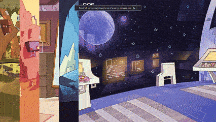

# OverSimplified Gallery



Welcome to **OverSimplified Gallery**, a minimalist gallery project built entirely with pure HTML and CSS. This project is perfect for anyone looking to quickly create a stylish and responsive gallery without relying on JavaScript or external frameworks.

## Features

- **Lightweight**: No JavaScript, just clean HTML and CSS.
- **Customizable**: Easy to adapt the styles to suit your needs.

## Demo

Check out a live preview of the gallery by opening the `index.html` file in any modern browser.

## Usage

1. Clone or download the repository.
2. Place your image files (e.g., JPEG, PNG) in the `images` directory.
3. Open `index.html` in your browser.

```bash
# Clone the repository
git clone https://github.com/ForeverWeLearn/oversimplified-gallery.git

# Navigate into the project directory
cd oversimplified-gallery

# Open in your browser
open index.html
```

## File Structure

```
/oversimplified-gallery
├── images/                     # Directory for your images
├── styles.css                  # Main stylesheet
├── index.html                  # Main HTML file
├── README.md                   # Project documentation
└── electrolize-regular.ttf     # Main font
```

## Customization

- Update the `index.html` file to include your desired images.
- Modify the `styles.css` file to change colors, spacing, or layout.

## Contributing

Contributions are welcome! If you have suggestions or improvements, feel free to create a pull request or open an issue.

## License

This project is licensed under the [MIT License](./LICENSE.txt). Please ensure the LICENSE file is present in the repository to avoid broken links or confusion.

---

Enjoy creating with OverSimplified Gallery! 🎨
